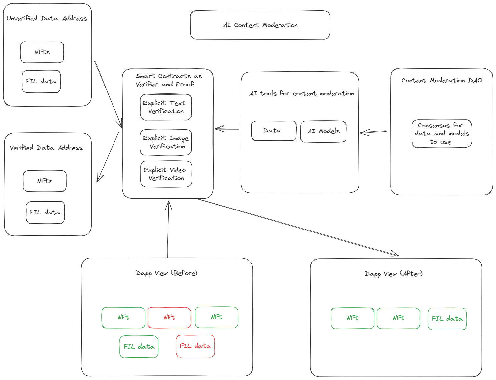

# Introduction

The content moderation project aims to address the challenges associated with ensuring safe and appropriate user-generated content within decentralized applications (dApps) and web3 environments. As the popularity of blockchain, DeFi, and P2P technologies continues to grow, it becomes crucial to develop robust and efficient tools to moderate content, filter out prohibited materials, and maintain a healthy and secure user experience.

### Content Moderation DAO

Establish a decentralized autonomous organization (DAO) dedicated to consensus-based decision-making on data collection and the selection of AI models for content moderation. The DAO will facilitate community participation, ensuring a diverse range of perspectives and transparent governance.

### AI Tools for Content Moderation

Create advanced AI tools, utilizing platforms such as **Bacalhau**, to perform content moderation tasks. These tools will leverage machine learning algorithms to analyze, filter, and flag content that violates predetermined guidelines, ensuring a safe and appropriate environment for users.

### Smart Contracts on the Filecoin Virtual Machine (FVM)

Utilize the power of the Filecoin Virtual Machine to store the addresses or locations of filtered content as proof of successful moderation. Smart contracts will verify whether content has passed the prohibited content test, providing an immutable record of filtered data.

### API/SDK for dApps:

Develop an API tool that dApps can integrate into their platforms to filter content based on the information provided by the smart contracts. This tool will enable seamless integration of content moderation functionalities into various decentralized applications, ensuring compliance with community guidelines and regulatory requirements.

### Data Verification Explorer

Establish a user-friendly interface that allows users to cross-check and verify the filtered data. The Data Verification Explorer will provide transparency and accountability, enabling users to validate the accuracy and effectiveness of the content moderation process.

By achieving these objectives, the project aims to contribute to the growth of decentralized ecosystems by fostering trust, safety, and user satisfaction.

